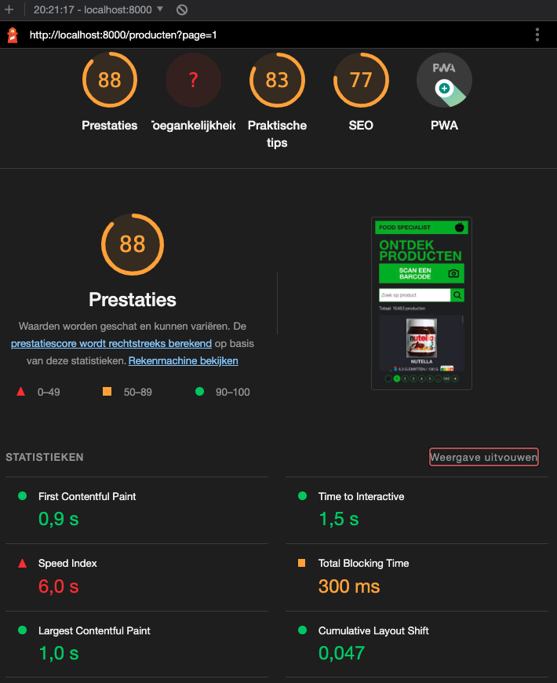
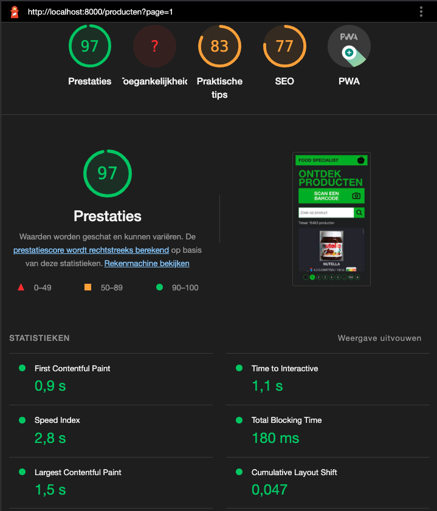
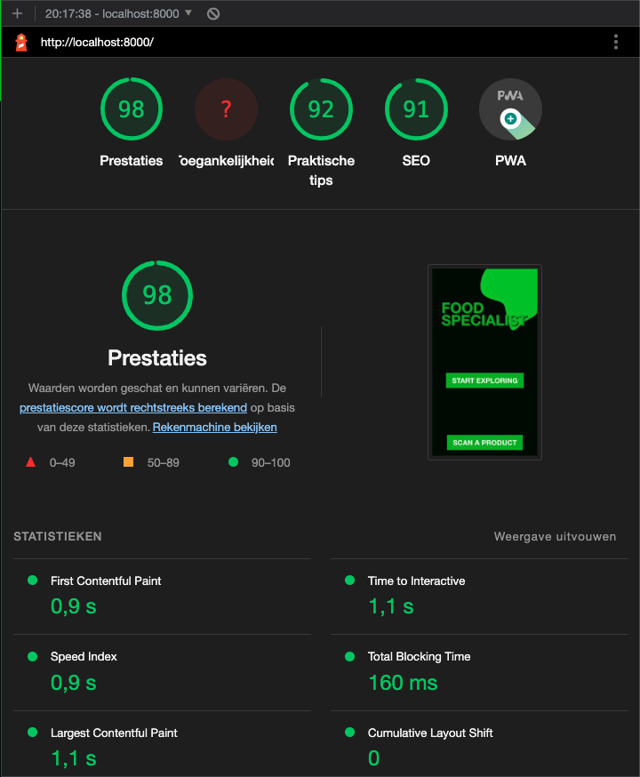
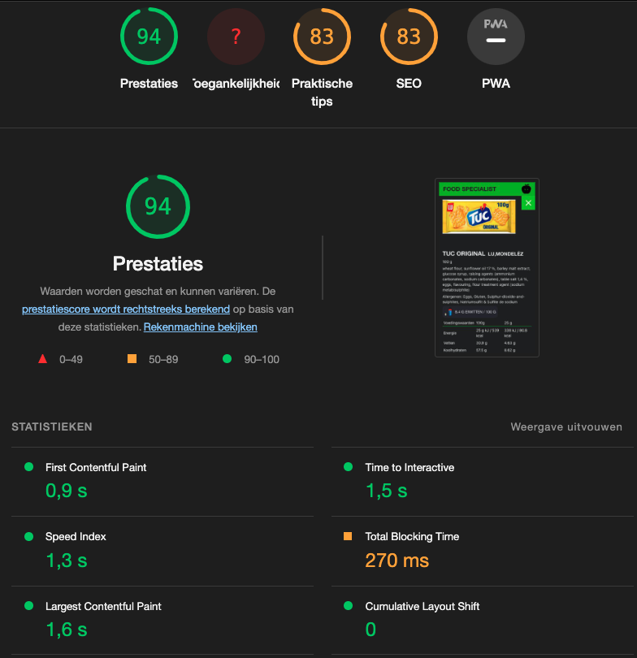

# Food Specialist On A Server

Gemaakt door Stefan Radouane

Minor Web design and Development - 2022/2023

<!-- De demo is te bekijken via deze [link](http://localhost:4000). -->

## Inhoudsopgave

- [ℹ️ Over dit project](#ℹ️-over-dit-project)
- [📥 Project installatie](#📥-project-installatie)
- [🧠 Client-server rendering](#🧠-client-server-rendering)
- [👷 Service worker](#👷-service-worker)
- [🚑 App optimalisatie](#🚑-app-optimalisatie)
- [📝 Criteria](#📝-criteria)

## ℹ️ Over dit project

Dit project is gemaakt voor het vak Progressive Web Apps. De code van het project is gebasseerd op de code van [Food Specialist](https://github.com/stefanradouane/food-specialist). Het is nu alleen de bedoeling geweest om de app nu te verplaatsen naar een Node.js server. De app moet dezelfde functionaliteiten hebben, alleen moet de app nu server-side gerendered worden in plaats van volledig client-side. De app is gebouwd dus gebouwd met client-server rendering om de performance van de website omhoog te halen en de tijdsduur van het critical rendering path verlagen.

## 📥 Project installatie

Om dit project lokaal te runnen is moet je de volgende stappen achter elkaar uitvoeren in de terminal.

1. Clone repository met `git clone <repo-url>`
2. Navigeer naar de juiste map `cd food-specialist-on-a-server`
3. Installeer dependencies met `npm install`
4. Bouw de bestanden en start de server met `npm run start`

### 🚧 Onderhoud

Om dit project te kunnen onderhouden is het de bedoeling dat je de bestanden opnieuw bouwt met het volgende command `npm run build`.

Je moet de bestanden opnieuw bouwen om ervoor te zorgen dat de bestaande cache van de service-worker wordt geleegt.

> Mocht dit nogsteeds problemen opleveren verwijder dan alle bestanden uit de cache.

## 🧠 Client-server rendering

De app maakt dus gebruik van client-server rendering om ervoor te zorgen dat de pagina's snel worden weergegeven voor de gebruikers. Bij client-server rendering wordt de HTML-content van de pagina gegenereerd op de server voordat deze naar de client wordt verzonden. Dit zorgt voor een snellere weergave van de pagina en een betere gebruikerservaring. In dit project word de HTML pagina gegenereerd door een Node.js server en EJS als templating engine.

Client-server rendering biedt ook voordelen op het gebied van SEO, omdat zoekmachines gemakkelijker de content van de pagina kunnen crawlen en indexeren. Dit kan leiden tot een betere positie in zoekresultaten en meer organisch verkeer naar de website.

De standaard wijze waarop mijn app werkt is door met een HTML pagina een verzoek te doen naar de server. De server doet vervolgens een verzoek naar de [API van Open Food Facts](https://openfoodfacts.github.io/api-documentation). Vervolgens rendered te server een HTML pagina en deze pagina naar de client gestuurd. Jammer genoeg heeft deze aanpak een aantal voordelen en nadelen. Een van de grootste voordelen is dat op het moment dat de pagina naar de client wordt gestuurd dat de pagina klaar is om te gebruiken. Het nadeel is alleen dat de API erg langzaam is. De percieved performance gaat dus omlaag door het met de server te renderen. Ik ga dit probleem oplossen door gebruik te maken van een [service worker](#👷-service-worker).

## 👷 Service worker

Wat is een Service Worker

Een service worker is een JavaScript-worker die in de browser draait en fungeert als een tussenpersoon tussen de webpagina en het netwerk. Het stelt ontwikkelaars in staat om progressieve webapps (PWA's) te maken die offline kunnen werken en sneller kunnen laden, zelfs bij slechte netwerkverbindingen.

Een service worker kan verschillende taken uitvoeren, zoals het cachen van bronnen zoals afbeeldingen, stylesheets en JavaScript-bestanden om offline toegang mogelijk te maken. Het kan ook pushmeldingen naar gebruikers sturen en de app updaten zonder dat de gebruiker de pagina hoeft te herladen.

Service workers maken gebruik van een caching-mechanisme dat de Cache API wordt genoemd. Dit stelt ontwikkelaars in staat om bepaalde bronnen op te slaan in een cache, zodat deze later snel kunnen worden opgehaald en getoond aan de gebruiker, zelfs wanneer de internetverbinding wegvalt. Service workers kunnen ook dynamisch de inhoud van de cache bijwerken, zodat gebruikers altijd de meest recente versie van de app zien.

Service workers zijn een krachtig hulpmiddel voor het bouwen van webapps die net zo responsief zijn als native apps. Ze bieden ontwikkelaars meer controle over hoe de app omgaat met netwerkverbindingen en maken het mogelijk om een ​​geweldige gebruikerservaring te bieden, zelfs in omstandigheden met een slechte internetverbinding.

### Werking service worker

De service worker is dus de tussenpersoon tussen de server en de client. Ik heb zelf ook een service worker geimplementeerd om te zorgen voor een fijne gebruikerservaring. Ik heb een activity diagram gemaakt om te illustreren hoe de service worker werkt.

#### Activiteiten diagram

Het bijgevoegde activiteiten diagram geeft een overzicht van de verschillende stappen die plaatsvinden bij het laden van de app, inclusief de Service Worker.

Load service worker

Use service worker

In dit diagram kun je zien dat de Service Worker, zodra deze is geïnstalleerd en geactiveerd, de netwerkrequests van de app onderschept. Bij een netwerkrequest zoekt de Service Worker eerst in de cache of de gevraagde asset al eerder is opgehaald. Als dit het geval is, stuurt de Service Worker de asset vanuit de cache terug naar de app. Als de asset nog niet in de cache aanwezig is, wordt deze opgehaald vanaf het netwerk en vervolgens gecached door de Service Worker voor toekomstig gebruik, dit word ook wel <em>runtime caching</em> genoemt.

Op deze manier kan de app bij het opnieuw openen van de pagina sneller worden weergegeven, omdat de Service Worker de benodigde assets al in de cache heeft opgeslagen. Dit zorgt voor een betere gebruikerservaring en verbeterd de prestaties van de app verbeteren.

## 🚑 App optimalisatie

### Critical render path

Wat is een critical render path

Het critical render path is de reeks stappen die een browser neemt om de inhoud van een webpagina te laden en weer te geven. Het omvat alles, van het downloaden van HTML, CSS en JavaScript-bestanden tot het berekenen van de lay-out van de pagina en het uiteindelijk tonen van de inhoud aan de gebruiker.

Elke stap in het kritieke renderpad heeft invloed op de tijd die nodig is om de pagina te laden en weer te geven. Het optimaliseren van het kritieke renderpad is daarom een ​​belangrijk onderdeel van het verbeteren van de prestaties van een webpagina.

De belangrijkste stappen in het kritieke renderpad zijn:

1. Verwerking van HTML: De browser downloadt en analyseert de HTML-code van de pagina om de structuur van de pagina te begrijpen.
2. Laden van CSS: De browser downloadt en analyseert de CSS-code om de visuele opmaak van de pagina te bepalen.
3. Laden van JavaScript: De browser downloadt en analyseert JavaScript-code om de dynamische functionaliteit van de pagina mogelijk te maken.
4. Berekening van de lay-out: De browser berekent de lay-out van de pagina op basis van de HTML-structuur en CSS-stijlen.
5. Schilderen van de pagina: De browser schildert de inhoud van de pagina op het scherm.

Om het kritieke renderpad te optimaliseren, moet je je zich richten op het minimaliseren van de hoeveelheid code die wordt gedownload, het verminderen van het aantal serveraanvragen en het verkleinen van de omvang van de HTML-, CSS- en JavaScript-bestanden. Andere technieken voor het optimaliseren van het kritieke renderpad zijn onder meer het gebruik van asynchrone of uitgestelde script-laden en het vermijden van render-blokkerende JavaScript-code.

Door het kritieke renderpad te optimaliseren, kunnen ontwikkelaars de laadtijd van een webpagina verkorten en de gebruikerservaring verbeteren.

In dit project heb ik verschillende technieken geïmplementeerd om de critical render path te optimaliseren.

### Optimalisaties voor de critical render path

Om de complete tijdsduur van de critical render path te verlagen heb ik de volgende optimalisaties geïmplementeerd:

- Minificatie van CSS en JavaScript bestanden
- Lazy loading van afbeeldingen
- Cachen van pagina's
- Cachen van images (als webp)
- Elk request sturen al gzip

Naast alles wat ik heb geimplementeerd waren er nog een aantal mogelijke optimalisaties die ik <em>(nog)</em> niet heb uitgevoerd:

- Minificatie van HTML
- Font caching (ik maak gebruik van open sans, dit is bijna op elk apparaat geinstallerd.)
- Asynchroon inladen van javascript.

#### Implementatie van de optimalisaties

Door het the minificeren van CSS en Javascript kan de browser deze bestanden sneller lezen en laden, daarnaast worden de bestanden gecached om de download tijd te verlagen. De afbeelding worden omgezet in webp (een kleiner bestandsformaat) om de laad tijd te verlagen, daarnaast worden ook de afbeeldingen gecached als webp om de grootte van de cache opslag te verkleinen. De afbeeldingen worden met lazy loading ingeladen, zodat niet alle afbeeldingen in een keer worden gedownload. De pagina's worden gecached om te zorgen dat de tweede keer dat de pagina wordt bezocht de laadtijd aanzienlijk afneemt. Tot slot word elk request vanuit de server verstuurd als gecomprimeerd gzip bestand. Dit zorgt ervoor dat de download grootte word verlaagd. Tot slot kan alles wat wordt gecached ook offline gebruikt worden, om de complete UX te verbeteren.

Door deze technieken toe te passen, hebben ik de critical render path van de app geoptimaliseerd en de prestaties en gebruikerservaring verbeterd om te zorgen voor een betere <em>runtime</em>.

### Optimalisaties voor de percieved performance

Wat is percieved performance

Uitleg wat is percieved performance

In dit project heb ik verschillende technieken geïmplementeerd om de percieved performance te optimaliseren.

#### Implementatie van de optimalisaties

Om de complete tijdsduur van de critical render path te verlagen heb ik de volgende optimalisaties geïmplementeerd:

- View transition API
- Front end requests
- Loading animations

##### View transition API

Een van de grootste voordelen van de View Transition API is dat het de "perceived performance" van je app verbetert. Dit betekent dat het de snelheid waarmee je app reageert en de responsiviteit van je app verbetert, waardoor gebruikers minder lang hoeven te wachten op de volgende actie die ze willen uitvoeren.

Dit komt doordat de View Transition API het proces van het laden van de inhoud van de volgende weergave achter de schermen afhandelt, terwijl de huidige weergave nog steeds zichtbaar is. Dit betekent dat gebruikers geen lege schermen of laadsymbolen te zien krijgen, wat hun ervaring naadlozer maakt. Dit kan vooral belangrijk zijn bij het laden van zware afbeeldingen, video's of andere media.

Bovendien biedt de View Transition API meer controle over de animatie-effecten die worden gebruikt bij het overgangen tussen weergaven, waardoor je je app een persoonlijker en unieker gevoel kunt geven. Dit kan resulteren in een betere gebruikerservaring en kan gebruikers helpen zich te onderscheiden van de concurrentie.

Al met al kan het gebruik van de View Transition API een aanzienlijke verbetering betekenen voor de "perceived performance" van je app en dus de gebruikerservaring. Het is zeker de moeite waard om te overwegen om deze API in je app te implementeren en te zien hoe het de prestaties van je app verbetert.

##### Front end requests

Door de requests op de front-end af te handelen als JS beschikbaar is dan wordt de percieved performance verbeterd. Dit komt omdat de default manier van de browser is dat de pagina volledig word geherladen en nu wordt er alleen een partial herladen.

##### Loading animations

Door tijdens de verzoeken op de front-end een loading animatie te tonen wordt de percieved performance versneld. Je weet dat de site bezig is in plaats van dat je hoopt dat de site bezig is.

### Resultaten optimalisaties

SS lighthouse voor optimalisaties

SS lighthouse na optimalisaties

> Op de schreenshots zijn de listview weergaven met elkaar vergeleken. Door de optimalisaties is de presatie van de app van een score van 88 naar een score van 97 gegaan. Dit kom grotendeels door de `speed index`.

SS lighthouse home page

SS lighthouse detail page

## :memo: Criteria

- [ ] Project Your app is published and can be accessed using the browser. Your project is thoroughly documented in the README.md file in your repository. Included are an explanation of client- server rendering, an activity diagram including the Service Worker and a list of enhancements to optimize the critical render path implemented your app.
- [ ] Serverside rendering You’ve implemented serverside rendering and have articulated how it works and why you should want it.
- [ ] Service Worker You’ve implemented a usefull Service Worker and show it’s working in an activity diagram.
- [ ] Critical render path You’ve enhanced the critical render path for a better runtime or percieved performance in multiple ways and have described how you managed to do this.
